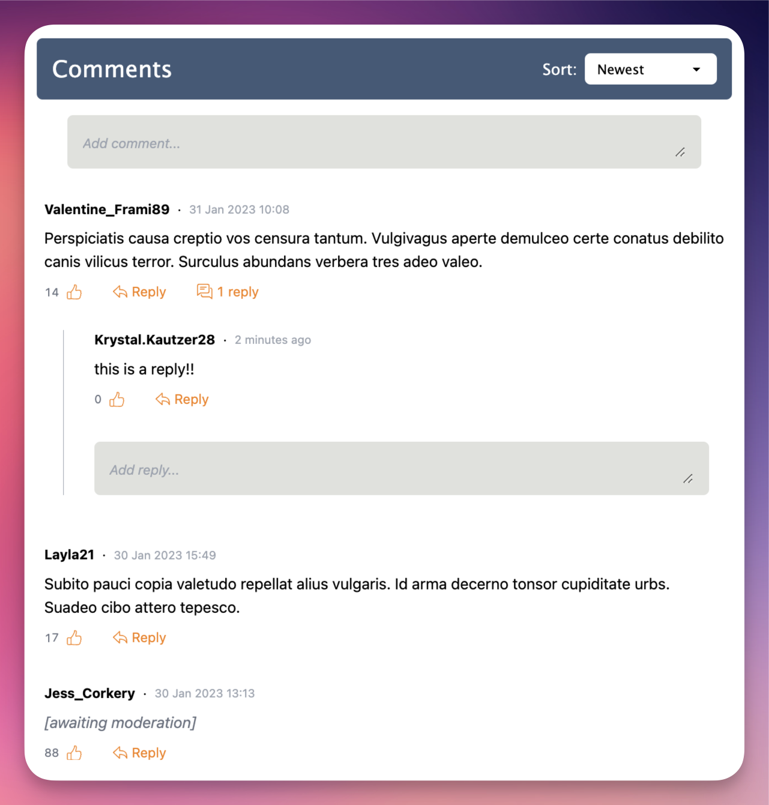

# Chatfall

Chatfall is a fully-featured self-hosted commenting system for easily adding comments to any webpage. 

It is built using [ElysiaJS](https://elysiajs.com/), [React](https://react.dev/) and [PostgreSQL](https://www.postgresql.org/) and has a whole host of features, including:

* Reply to and like comments.
* Replies to any comment, no depth limits.
* Sort comments by: newest/oldest, most/least replied-to, most/least liked.
* Mobile-friendly responsive interface.
* Quick and simple registration by email.
* Real-time in-page notifications (using [Websockets](https://developer.mozilla.org/en-US/docs/Web/API/WebSockets_API)).
* Comprehensive admin features:
  * Set the minimum amount of time a user must wait before posting again.
  * Ban by email and/or email domain.
  * Delete unwanted comments.
  * Mark all comments as requiring moderation.
  * Approve/deny comments marked as requiring moderation.
  * Set banned words.

Chatfall is a distributed as a **single binary executable** - yes, you read that correctly! Bundled using [bun](https://bun.sh), it makes deploying and hosting Chatfall super easy.

[Live demo](https://chatfall-9mb69.ondigitalocean.app/test.html)

## Documentation

Please refer to https://chatfall.com or the [`website/docs/`](https://github.com/hiddentao/chatfall/tree/website/website/docs) folder in this repository for the full documentation.

## Acknowledgements

* [ElysiaJS template by Tanishq Manuja](https://github.com/tanishqmanuja/todos-react-elysia)

## License

MIT - see [LICENSE.md](LICENSE.md)

