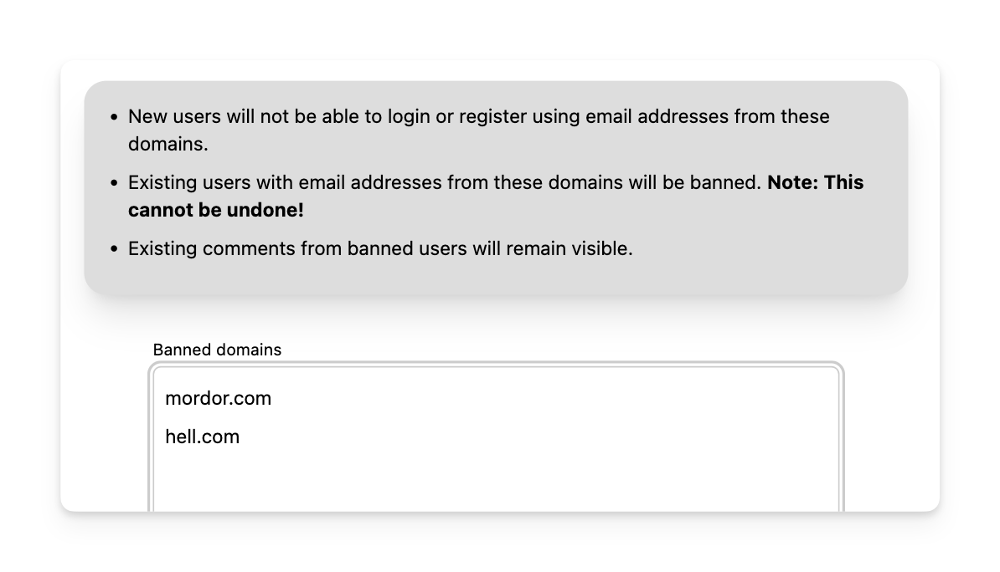

# Banning users

Users can be banned by entering their email address in the _"Banned emails"_ section.

Note that once a user is banned they will not be able to login or post any further comments. They will also not be able to sign up again 
with the same email address.

Any existing comments made by the banned user will still be visible to other users, but it will be clearly indicated that 
the comment author has been banned.

## Ban by domain

Sometimes it can be useful to ban all email addresses associated with a particular domain. This can be done by entering the domain 
into the _"Banned domains"_ section.

The same rules as above apply when banning by domain.

