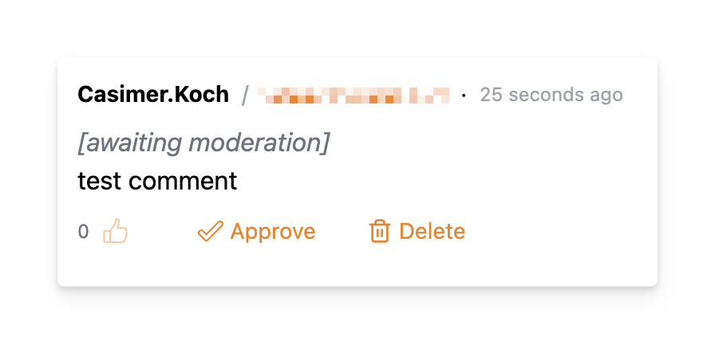
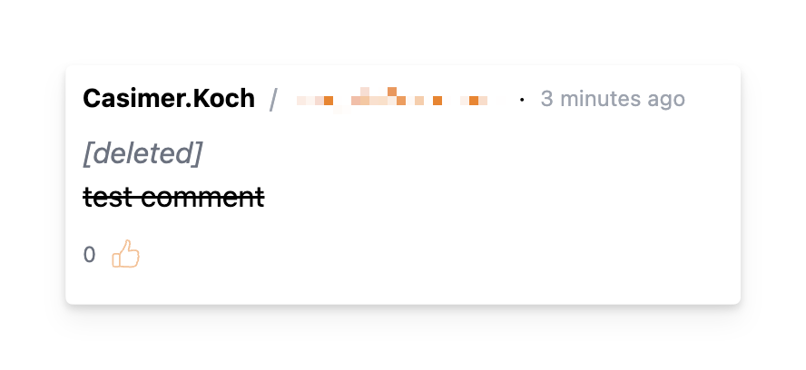

# Comments admin

This is where you can search, moderate and delete comments. Previously deleted comments will also be shown here.

By default, all comments for all web pages are shown. You can use the URL filter at the top to narrow down the comments shown.

Users' email addresses are also shown in case you need to contact them.

## Moderating comments

For comments that are awaiting moderation, you will see an _"Approve"_ button. Clicking this will approve the comment and make it visible to all users.

## Deleting comments

Any comment can be deleted. A deleted comment will not be visible to any users but will be visible in the admin interface:

