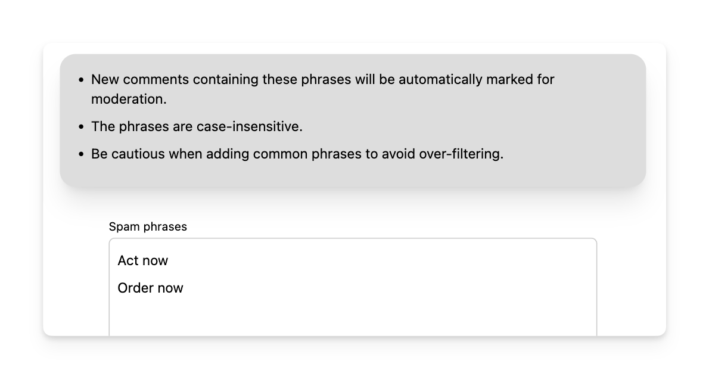

# Spam phrases

To handle spam comments you can opt to have new comments containing certain phrases automatically marked for moderation.  This can be done by entering such phrases into the _"Spam phrases"_ list.

_NOTE: existing comments will NOT be affected by any changes you make to this list._

