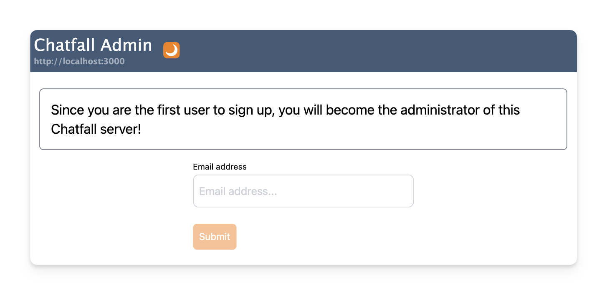
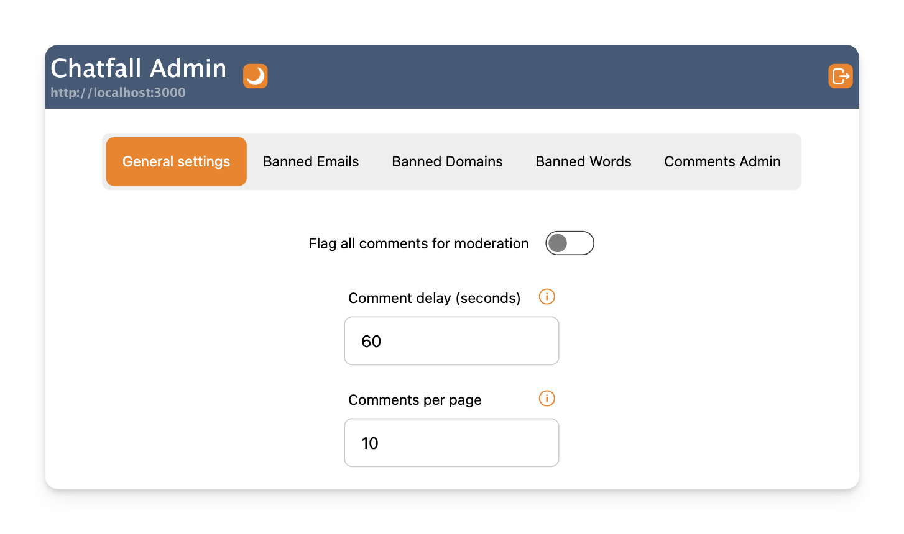

import Tabs from '@theme/Tabs';
import TabItem from '@theme/TabItem';

# Start the server

Now we're ready to run the server:

<Tabs>
<TabItem value="binary" label="Binary">

```bash
./chatfall server
```

</TabItem>
<TabItem value="bun" label="Bun">

```bash
bun chatfall-server.js server
```

</TabItem>
</Tabs>

You should see a log message that looks like the following:

```
🦊 Chatfall server v0.17.0 started in 0.25 ms

 ➜  Running at:   http://localhost:3000/
```

## Create the admin user

Visit http://localhost:3000 in your browser and you should see the admin interface login page:



:::info
The first user to login will automatically be made an admin!
:::

At this point you can create your first user account by using it to login to the admin interface. 

You will need to enter your email address and then you will receive a verification code by email. Enter the code to verify your email address 
and login.

_NOTE: Because we earlier set the `LOG_LEVEL` environment variable to `debug` you should see the email verification code in the shell/terminal 
in which you are running the server._

One you're logged in to the admin interface you can can explore some of the [settings available](../category/admin-interface):



Or you can skip ahead to the next section and [write some comments](./write-comments.mdx).


