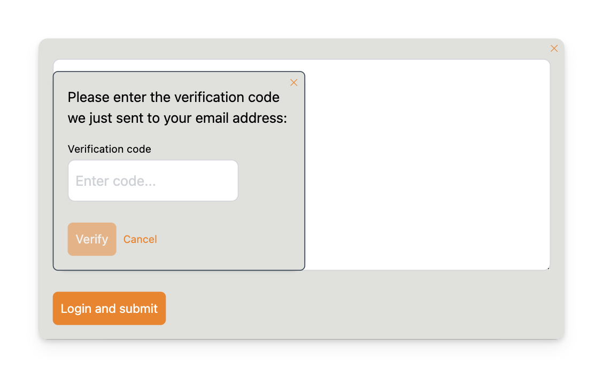

# Write comments

Now that the server is up and running you can test out the commenting system by visiting http://localhost:3000/test.html 
in your browser. 

This is a test page that is always available for testing any Chatfall server. It is also a live example of how to embed 
the commenting system in your own web page.

## Adding Comments

The comment system provides a responsive input form that works seamlessly on both desktop and mobile devices.

Click the comment input area to open the comment form popup.

When you click the "Login and Submit" button you will be prompted to enter your email address. 

Once submitted you'll receive a verification code by email. Enter the code to verify your email:

Once verified your comment will be submitted. At this point you will be logged in and 
can submit additional comments in future without re-verifying your email.

## Replying to Comments

To reply to an existing comment click the **Reply** button below any comment. The reply form will appear as a popup:

Once submitted your reply will appear nested under the parent comment:

## Liking/unliking comments

You can like/unlike comments by clicking the thumbs up icon:

## Sorting & Navigation

By default comments are sorted by newest first. You can change the sort mode using the dropdown in the top right:

## Loading more

The system loads 10 comments at a time. Click **Load more comments** at the bottom to load additional comments according to 
the current sort mode:

The same mechanism also applies when viewing replies.

## Next steps

The rest of the documentation deep dives into the various aspects of using Chatfall, as well as customization, admin settings, moderation and 
how to deploy it.

