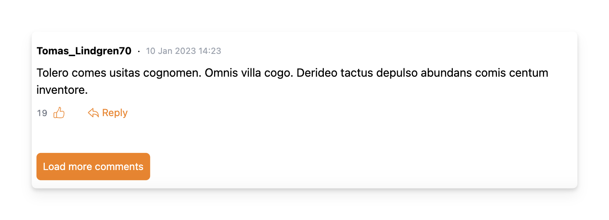
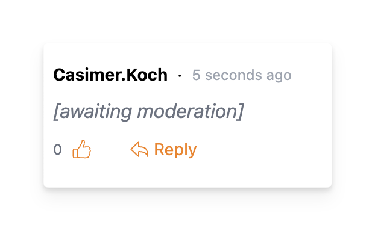
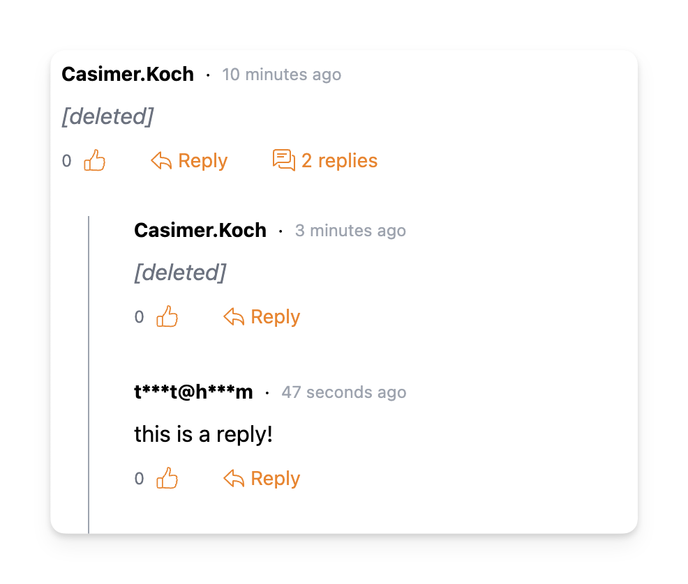

# Comment visibility

By default only 10 comments are shown at a time, whether that be the top level comments or replies to a comment. 

To load more comments you can click the _"Load more comments"_ button at the bottom of a comment thread.

## Awaiting moderation

When a comment is awaiting moderation its content is replaced with a message to the effect that the comment is awaiting moderation.

## Deleted comments

Deleted comments are still visible but their content is replaced with a message to the effect that the comment has been deleted.

Replies of deleted comments will remain visible.

