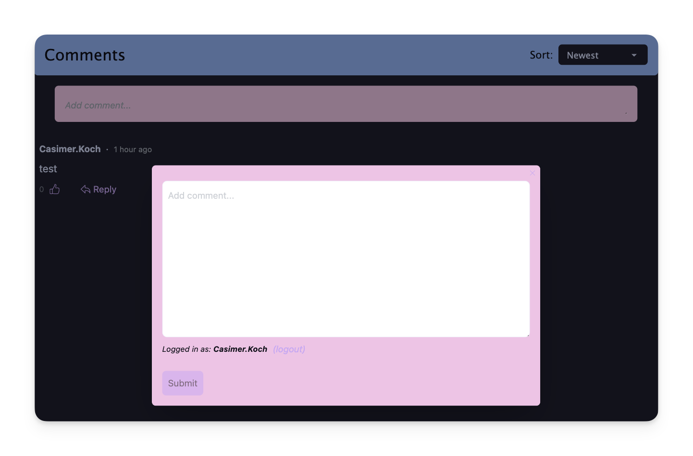

# Theming

Chatfall is built on the [DaisyUI](https://daisyui.com/) framework, and comes with two built-in 
themes - a light theme and a dark theme.

By default the theme used will match the user's system theme.

To disable this and force a specific theme you can set the `mode` option in the `Chatfall.init` call:

```javascript
Chatfall.init({
  mode: 'dark', // force dark theme, use "light" to force light theme
});
```

You can also override each of these themes' colours:

```javascript
Chatfall.init({
  lightThemeOverride: {
    colors: { 
      "base-100": // HEX color value
      "base-content": // HEX color value
      "base-200": // HEX color value
      "base-300": // HEX color value
      "primary": // HEX color value
      "primary-content": // HEX color value
      "secondary": // HEX color value
      "secondary-content": // HEX color value
      "neutral": // HEX color value
      "neutral-content": // HEX color value
      "info": // HEX color value
      "info-content": // HEX color value
      "error": // HEX color value
      "error-content": // HEX color value
    }
  },
  darkThemeOverride: {
    colors: { 
      // ...same as above
    }
  },
});
```

An example (see below for the color values):




```javascript
"base-100": "#1e1e2e",
"base-content": "#cdd6f4",
"base-200": "#181825",
"base-300": "#11111b",
"primary": "#cba6f7",
"primary-content": "#11111b",
"secondary": "#f5c2e7",
"secondary-content": "#11111b",
"neutral": "#313244",
"neutral-content": "#cdd6f4",
"info": "#89b4fa",
"info-content": "#11111b",
"error": "#f38ba8",
"error-content": "#11111b"
``` 

:::tip
There are various predefined color palettes available in the [DaisyUI themes page](https://daisyui.com/docs/themes/).
:::
